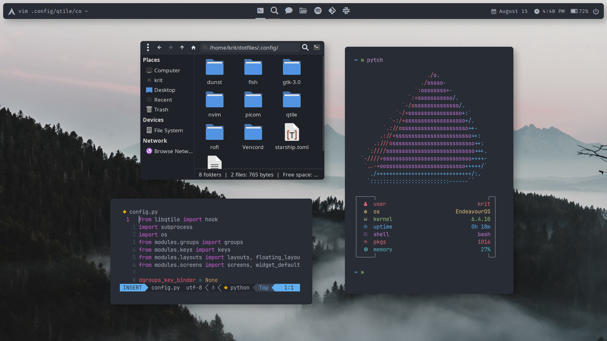
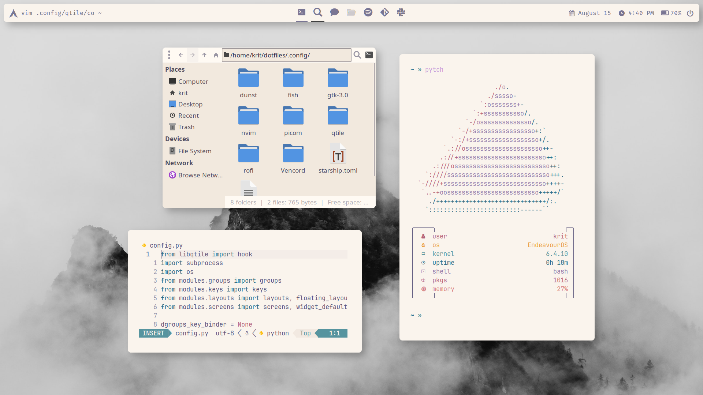

# Dotfiles

These are my personal dotfiles for my EndeavourOS system, though they should work on most Linux systems. They include both a dark theme (OneDark) and a light theme (Rosé Pine Dawn) which can easily be switched by the shortcut Mod+t, where Mod is your keyboard's logo key (view `.config/qtile/modules/keys.py` for the full list of keybindings). Some highlights include my personal font [JetFlow](https://github.com/kritdass/JetFlow) and my fetch [Pytch](https://github.com/kritdass/pytch).

## Showcase

### Dark (OneDark)

### Light (Rosé Pine Dawn)

## Programs
**Window Manager:** [Qtile (git)](https://qtile.readthedocs.io/en/latest/) \
**Compositor:** [Picom (fdev31)](https://github.com/fdev31/picom/) \
**Terminal Emulator:** [St (siduck)](https://github.com/siduck/st) \
**Shell:** [Fish](https://fishshell.com/) \
**Editor:** [LazyVim](https://www.lazyvim.org/) \
**App Launcher:** [Rofi](https://github.com/davatorium/rofi) \
**Notifications:** [Dunst](https://dunst-project.org/) \
**Fetch:** [Pytch](https://github.com/kritdass/pytch)

## Setup
1. On top of the programs listed above, you will need to install:
    - [Fisher](https://github.com/jorgebucaran/fisher)
    - [Starship](https://starship.rs/)
    - [Fira Code Nerd Font](https://github.com/ryanoasis/nerd-fonts/tree/master/patched-fonts/FiraCode)
    - [JetFlow](https://github.com/kritdass/JetFlow/)
    - [Inter](https://fonts.google.com/specimen/Inter)
    - [WhiteSur Icon Theme](https://github.com/vinceliuice/WhiteSur-icon-theme)
    - [WhiteSur OneDark GTK Theme](https://github.com/xXTgamerXx/WhiteSur-onedark-gtk-theme)
    - [Rosé Pine GTK Theme](https://github.com/rose-pine/gtk)
    - [Vencord](https://vencord.dev/)
    - [`qtile-extras` (git)](https://qtile-extras.readthedocs.io/en/latest/)
    - [`dbus-next`](https://github.com/altdesktop/python-dbus-next/)
    - [`xsettingsd`](https://codeberg.org/derat/xsettingsd)
2. Install [`stow`](https://www.gnu.org/software/stow/).
3. Clone this repository, go into it, and run `stow .` (make sure to remove any conflicting files/directories).
4. Go to `.config/qtile/utils/settings.py` and edit to your liking.
5. Check if your programs support using GTK or system theme and enable as such.
